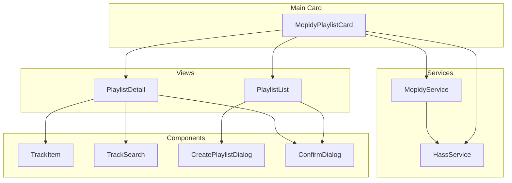
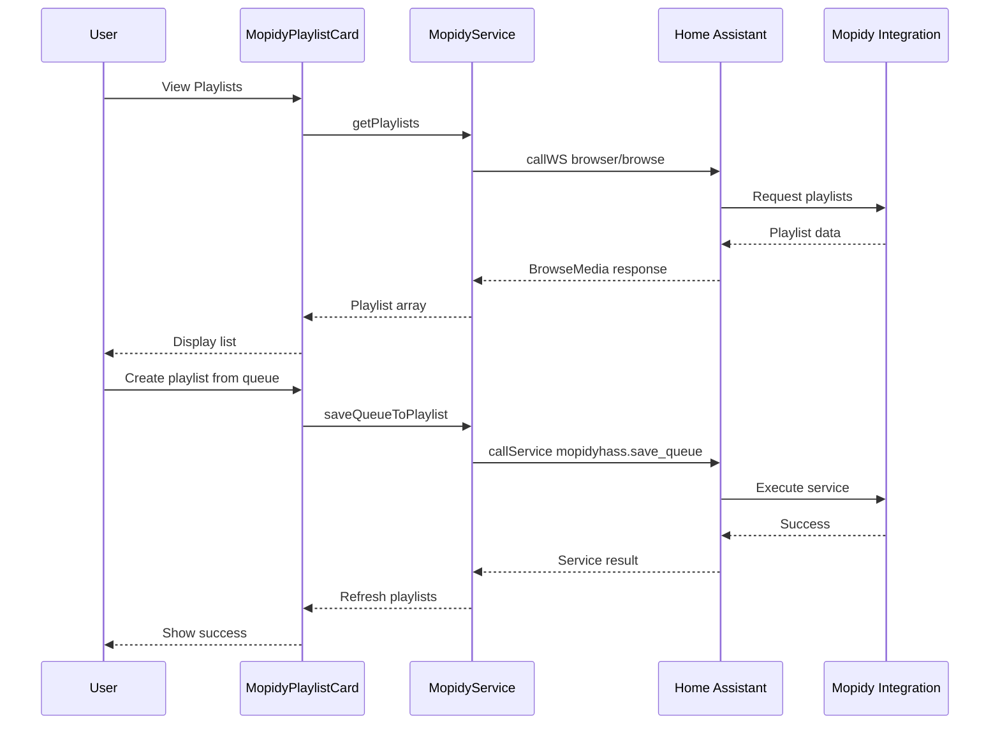

# Mopidy Playlist Management Custom Card - Implementation Plan

## Overview

This plan outlines the development of a custom Home Assistant Lovelace card for managing Mopidy playlists. The card will provide a visual interface for creating, modifying, and removing playlists, leveraging the existing backend services from the mopidyhass integration.

## Required Features

Based on the requirements:

| Feature | Description |
|---------|-------------|
| Create playlist from queue | Save current queue contents as a new playlist |
| Add songs to playlist | Add tracks from queue or search to existing playlist |
| Reorder songs in playlist | Drag-and-drop track reordering |
| Remove song from playlist | Delete individual tracks from playlist |
| Delete playlist | Remove entire playlist |

## Technology Stack

| Component | Technology | Rationale |
|-----------|------------|-----------|
| Language | TypeScript | Type safety, better IDE support, industry standard for HA cards |
| UI Framework | Lit 3.x | Native Home Assistant card framework, lightweight, reactive |
| Build Tool | Vite | Fast builds, modern ESM output, HMR for development |
| Package Manager | npm | Standard for Home Assistant custom cards |
| Drag and Drop | SortableJS | Mature library, works well with touch and mouse |
| Styling | CSS with Lit | Scoped styles, no external dependencies |

## Project Structure

```
mopidy-playlist-card/
├── src/
│   ├── index.ts                    # Main entry point, card registration
│   ├── mopidy-playlist-card.ts     # Main card component
│   ├── components/
│   │   ├── playlist-list.ts        # List of all playlists
│   │   ├── playlist-detail.ts      # Single playlist view with tracks
│   │   ├── playlist-editor.ts      # Card configuration editor
│   │   ├── track-item.ts           # Individual track row component
│   │   ├── track-search.ts         # Search/add tracks component
│   │   ├── create-playlist-dialog.ts # Dialog for new playlist
│   │   └── confirm-dialog.ts       # Reusable confirmation dialog
│   ├── services/
│   │   ├── mopidy-service.ts       # HA service call wrapper
│   │   └── hass-service.ts         # Home Assistant API helpers
│   ├── models/
│   │   ├── playlist.ts             # Playlist data model
│   │   ├── track.ts                # Track data model
│   │   └── queue-item.ts           # Queue item model
│   ├── utils/
│   │   ├── formatting.ts           # Time formatting, etc.
│   │   └── debounce.ts             # Debounce utility
│   └── styles/
│       ├── shared-styles.ts        # Common styles
│       └── theme.ts                # Theme variables
├── dist/                           # Build output
├── hacs.json                       # HACS configuration
├── package.json
├── tsconfig.json
├── vite.config.ts
└── README.md
```

## Architecture

### Component Hierarchy



### Data Flow



## Service Integration

### Available Backend Services

The card will consume these services from the mopidyhass integration:

| Service | Parameters | Purpose |
|---------|------------|---------|
| `{entity}_create_playlist` | name, uri_scheme? | Create empty playlist |
| `{entity}_delete_playlist` | uri | Delete playlist |
| `{entity}_rename_playlist` | uri, name | Rename playlist |
| `{entity}_add_to_playlist` | playlist_uri, track_uris, position? | Add tracks |
| `{entity}_remove_from_playlist` | playlist_uri, positions | Remove tracks |
| `{entity}_move_in_playlist` | playlist_uri, start, end, new_position | Reorder tracks |
| `{entity}_clear_playlist` | uri | Clear all tracks |
| `{entity}_save_queue_to_playlist` | name, uri_scheme? | Save queue as playlist |

### Service Wrapper Implementation

```typescript
// services/mopidy-service.ts
class MopidyService {
  constructor(private hass: HomeAssistant, private entityId: string) {}
  
  async getPlaylists(): Promise<Playlist[]>
  async getPlaylist(uri: string): Promise<PlaylistDetail>
  async getQueue(): Promise<Track[]>
  
  async createPlaylist(name: string, uriScheme?: string): Promise<void>
  async deletePlaylist(uri: string): Promise<void>
  async renamePlaylist(uri: string, name: string): Promise<void>
  
  async addToPlaylist(playlistUri: string, trackUris: string[], position?: number): Promise<void>
  async removeFromPlaylist(playlistUri: string, positions: number[]): Promise<void>
  async moveInPlaylist(playlistUri: string, start: number, end: number, newPosition: number): Promise<void>
  
  async saveQueueToPlaylist(name: string, uriScheme?: string): Promise<void>
}
```

## Data Models

### Playlist Model

```typescript
interface Playlist {
  uri: string;           // e.g., "m3u:my_playlist.m3u"
  name: string;          // Display name
  trackCount?: number;   // Number of tracks
  lastModified?: Date;   // Last modification time
}

interface PlaylistDetail extends Playlist {
  tracks: Track[];
  duration?: number;     // Total duration in seconds
}

interface Track {
  uri: string;           // Track URI
  name: string;          // Track title
  artists?: string[];    // Artist names
  album?: string;        // Album name
  duration?: number;     // Duration in seconds
  trackNo?: number;      // Track number in playlist
}
```

## UI/UX Design

### Card Configuration

```yaml
type: custom:mopidy-playlist-card
entity: media_player.living_room_mopidy
title: Playlist Manager  # Optional
show_queue_button: true  # Show save queue button
theme: default           # Optional theme override
```

### Main Views

#### 1. Playlist List View

```
┌─────────────────────────────────────────┐
│  🎵 Playlist Manager          [+ New]   │
├─────────────────────────────────────────┤
│  ┌─────────────────────────────────┐    │
│  │ 📋 My Favorites          (42)   │ >  │
│  └─────────────────────────────────┘    │
│  ┌─────────────────────────────────┐    │
│  │ 📋 Rock Classics         (28)   │ >  │
│  └─────────────────────────────────┘    │
│  ┌─────────────────────────────────┐    │
│  │ 📋 Jazz Evening          (15)   │ >  │
│  └─────────────────────────────────┘    │
│                                         │
│  [💾 Save Current Queue]                │
└─────────────────────────────────────────┘
```

#### 2. Playlist Detail View

```
┌─────────────────────────────────────────┐
│  [< Back]  My Favorites         [🗑️]    │
├─────────────────────────────────────────┤
│  42 tracks • 2h 34m                     │
│                                         │
│  ┌─────────────────────────────────┐    │
│  │ ☰ 1. Bohemian Rhapsody         │    │
│  │     Queen • 5:55               │ ×  │
│  └─────────────────────────────────┘    │
│  ┌─────────────────────────────────┐    │
│  │ ☰ 2. Stairway to Heaven        │    │
│  │     Led Zeppelin • 8:02        │ ×  │
│  └─────────────────────────────────┘    │
│  ┌─────────────────────────────────┐    │
│  │ ☰ 3. Hotel California          │    │
│  │     Eagles • 6:30              │ ×  │
│  └─────────────────────────────────┘    │
│                                         │
│  [+ Add Tracks]  [▶ Play All]           │
└─────────────────────────────────────────┘
```

#### 3. Create Playlist Dialog

```
┌─────────────────────────────────────────┐
│  Create New Playlist              [✕]   │
├─────────────────────────────────────────┤
│                                         │
│  Playlist Name                          │
│  ┌───────────────────────────────────┐  │
│  │ My New Playlist                   │  │
│  └───────────────────────────────────┘  │
│                                         │
│  Source                                 │
│  ○ Empty playlist                       │
│  ● Current queue (12 tracks)            │
│                                         │
│  [Cancel]              [Create]         │
└─────────────────────────────────────────┘
```

### Interaction Patterns

| Action | Implementation |
|--------|----------------|
| View playlist | Tap on playlist row |
| Delete playlist | Tap trash icon, confirm dialog |
| Rename playlist | Long press or edit button |
| Reorder tracks | Drag handle, touch-friendly |
| Remove track | Tap X button, optional undo |
| Add tracks | Button opens search modal |
| Create from queue | Dedicated button or dialog option |

## Card Configuration Editor

The card will include a visual configuration editor for the Lovelace UI:

```typescript
// components/playlist-editor.ts
class PlaylistEditor extends LitElement {
  @property() hass!: HomeAssistant;
  @property() config!: PlaylistCardConfig;
  
  // Config options:
  // - Entity selector (media_player domain)
  // - Title input
  // - Show queue button toggle
  // - Theme selector
}
```

## Build Configuration

### package.json

```json
{
  "name": "mopidy-playlist-card",
  "version": "1.0.0",
  "type": "module",
  "scripts": {
    "dev": "vite",
    "build": "tsc && vite build",
    "preview": "vite preview",
    "lint": "eslint src --ext .ts"
  },
  "dependencies": {
    "lit": "^3.1.0",
    "sortablejs": "^1.15.0"
  },
  "devDependencies": {
    "@types/sortablejs": "^1.15.0",
    "typescript": "^5.3.0",
    "vite": "^5.0.0",
    "home-assistant-js-websocket": "^9.0.0"
  }
}
```

### vite.config.ts

```typescript
import { defineConfig } from 'vite';
import { resolve } from 'path';

export default defineConfig({
  build: {
    lib: {
      entry: resolve(__dirname, 'src/index.ts'),
      name: 'MopidyPlaylistCard',
      fileName: 'mopidy-playlist-card',
      formats: ['es']
    },
    rollupOptions: {
      external: ['home-assistant-js-websocket'],
      output: {
        globals: {
          'home-assistant-js-websocket': 'window.__HA_WS__'
        }
      }
    }
  }
});
```

### hacs.json

```json
{
  "name": "Mopidy Playlist Card",
  "content_in_root": false,
  "filename": "dist/mopidy-playlist-card.js",
  "country": [],
  "homeassistant": "2024.1.0",
  "render_readme": true
}
```

## Implementation Steps

### Phase 1: Foundation

1. Initialize npm project with TypeScript and Vite
2. Configure build pipeline for Home Assistant compatibility
3. Create basic card registration and rendering
4. Implement configuration schema and editor

### Phase 2: Core Features

5. Implement playlist list view with data fetching
6. Create playlist detail view with track listing
7. Add create playlist from queue functionality
8. Implement delete playlist with confirmation

### Phase 3: Track Management

9. Add track removal from playlist
10. Implement drag-and-drop track reordering
11. Create track search and add functionality
12. Add batch operations support

### Phase 4: Polish

13. Add loading states and error handling
14. Implement responsive design for mobile
15. Add accessibility features
16. Create comprehensive documentation

## Testing Strategy

### Manual Testing Checklist

- [ ] Card loads in Lovelace without errors
- [ ] Configuration editor saves settings correctly
- [ ] Playlists load and display correctly
- [ ] Create playlist from queue works
- [ ] Delete playlist with confirmation works
- [ ] Track reordering persists correctly
- [ ] Track removal works
- [ ] Mobile touch interactions work
- [ ] Theme changes apply correctly

### Browser Compatibility

- Chrome/Chromium (Desktop & Mobile)
- Firefox (Desktop & Mobile)
- Safari (Desktop & Mobile)
- Edge

## Deployment

### HACS Installation

1. Add repository as custom repository in HACS
2. Install via HACS dashboard
3. Add resource reference if not automatic
4. Add card to Lovelace dashboard

### Manual Installation

1. Copy `dist/mopidy-playlist-card.js` to `/config/www/`
2. Add to Lovelace resources:
   ```yaml
   resources:
     - url: /local/mopidy-playlist-card.js
       type: module
   ```
3. Add card to dashboard

## Dependencies

### Required

- Home Assistant 2024.1.0+
- Mopidy Hass Playlists integration with services enabled
- Modern browser with ES modules support

### Optional

- HACS for easy installation and updates

## Security Considerations

- No external API calls - all communication through Home Assistant
- No sensitive data storage
- Service calls use Home Assistant's existing authentication
- XSS prevention through Lit's built-in sanitization

## Future Enhancements

Potential features for future versions:

- Playlist search and filtering
- Batch track selection and operations
- Playlist export/import
- Album art display
- Playlist sharing between entities
- Undo/redo for operations
- Playlist statistics and analytics
