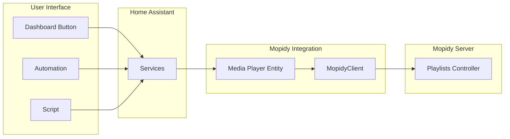
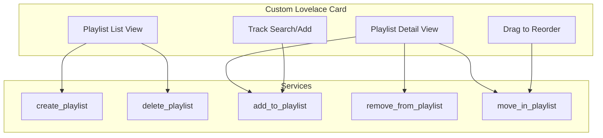

# Playlist Management Implementation Plan

## Executive Summary

**Question:** Can the existing media card manage playlists - create, modify, and delete?

**Answer:** The standard Home Assistant media card **cannot directly manage playlists**. The media browser API only supports browsing and playing content. However, playlist management **can be implemented** through Home Assistant services, following the same pattern as the existing queue management services.

## Current State Analysis

### Existing MopidyClient Playlist APIs

The [`MopidyClient`](custom_components/mopidyhass/mopidy_client.py:50) already has the necessary playlist CRUD methods:

| Method | Mopidy API | Status |
|--------|------------|--------|
| [`create_playlist(name, uri_scheme)`](custom_components/mopidyhass/mopidy_client.py:587) | `core.playlists.create` | Implemented |
| [`delete_playlist(uri)`](custom_components/mopidyhass/mopidy_client.py:607) | `core.playlists.delete` | Implemented |
| [`save_playlist(playlist)`](custom_components/mopidyhass/mopidy_client.py:619) | `core.playlists.save` | Implemented |
| [`get_playlists()`](custom_components/mopidyhass/mopidy_client.py:553) | `core.playlists.as_list` | Implemented |
| [`get_playlist(uri)`](custom_components/mopidyhass/mopidy_client.py:567) | `core.playlists.lookup` | Implemented |

### Home Assistant Media Browser Limitations

The [`BrowseMedia`](custom_components/mopidyhass/media_player.py:546) class only supports:
- `can_play` - Whether the item can be played
- `can_expand` - Whether the item has children to browse
- `children` - List of child items

There is **no native support** for:
- Delete actions
- Create/rename dialogs
- Drag-and-drop reordering
- Context menus

### Existing Service Pattern

The integration already uses services for queue management in [`media_player.py`](custom_components/mopidyhass/media_player.py:51):
- `{entity_name}_clear_queue`
- `{entity_name}_remove_from_queue` 
- `{entity_name}_move_in_queue`

## Proposed Solution

Implement playlist management through **Home Assistant services**, enabling users to:
1. Call services directly from automations/scripts
2. Create dashboard buttons to trigger services
3. Use the services in Lovelace card configurations

### Service Architecture



---

## Services to Implement

### 1. create_playlist

Create a new empty playlist.

**Service:** `mopidyhass.{entity_name}_create_playlist`

**Parameters:**
| Name | Type | Required | Description |
|------|------|----------|-------------|
| name | string | Yes | Name for the new playlist |
| uri_scheme | string | No | Backend scheme - e.g., m3u, spotify |

**Example:**
```yaml
service: mopidyhass.living_room_create_playlist
data:
  name: "My New Playlist"
  uri_scheme: "m3u"  # Optional
```

### 2. delete_playlist

Delete an existing playlist.

**Service:** `mopidyhass.{entity_name}_delete_playlist`

**Parameters:**
| Name | Type | Required | Description |
|------|------|----------|-------------|
| uri | string | Yes | URI of playlist to delete |

**Example:**
```yaml
service: mopidyhass.living_room_delete_playlist
data:
  uri: "m3u:my_playlist.m3u"
```

### 3. rename_playlist

Rename an existing playlist.

**Service:** `mopidyhass.{entity_name}_rename_playlist`

**Parameters:**
| Name | Type | Required | Description |
|------|------|----------|-------------|
| uri | string | Yes | URI of playlist to rename |
| name | string | Yes | New name for the playlist |

**Example:**
```yaml
service: mopidyhass.living_room_rename_playlist
data:
  uri: "m3u:my_playlist.m3u"
  name: "Renamed Playlist"
```

### 4. add_to_playlist

Add tracks to a playlist.

**Service:** `mopidyhass.{entity_name}_add_to_playlist`

**Parameters:**
| Name | Type | Required | Description |
|------|------|----------|-------------|
| playlist_uri | string | Yes | URI of target playlist |
| track_uris | list | Yes | List of track URIs to add |
| position | integer | No | Position to insert at - default append |

**Example:**
```yaml
service: mopidyhass.living_room_add_to_playlist
data:
  playlist_uri: "m3u:my_playlist.m3u"
  track_uris:
    - "spotify:track:4uLU6hMCjMI75M1A2tKUQC"
    - "local:track:song.mp3"
  position: 0  # Optional - insert at beginning
```

### 5. remove_from_playlist

Remove tracks from a playlist.

**Service:** `mopidyhass.{entity_name}_remove_from_playlist`

**Parameters:**
| Name | Type | Required | Description |
|------|------|----------|-------------|
| playlist_uri | string | Yes | URI of target playlist |
| positions | list | Yes | List of track positions to remove - 0-indexed |

**Example:**
```yaml
service: mopidyhass.living_room_remove_from_playlist
data:
  playlist_uri: "m3u:my_playlist.m3u"
  positions: [0, 2, 5]  # Remove tracks at these positions
```

### 6. move_in_playlist

Reorder tracks within a playlist.

**Service:** `mopidyhass.{entity_name}_move_in_playlist`

**Parameters:**
| Name | Type | Required | Description |
|------|------|----------|-------------|
| playlist_uri | string | Yes | URI of target playlist |
| start | integer | Yes | Start position of range to move |
| end | integer | Yes | End position of range - exclusive |
| new_position | integer | Yes | Target position to move to |

**Example:**
```yaml
service: mopidyhass.living_room_move_in_playlist
data:
  playlist_uri: "m3u:my_playlist.m3u"
  start: 0
  end: 2
  new_position: 5  # Move first two tracks to position 5
```

### 7. clear_playlist

Remove all tracks from a playlist without deleting it.

**Service:** `mopidyhass.{entity_name}_clear_playlist`

**Parameters:**
| Name | Type | Required | Description |
|------|------|----------|-------------|
| uri | string | Yes | URI of playlist to clear |

**Example:**
```yaml
service: mopidyhass.living_room_clear_playlist
data:
  uri: "m3u:my_playlist.m3u"
```

### 8. save_queue_to_playlist

Save current queue as a new playlist.

**Service:** `mopidyhass.{entity_name}_save_queue_to_playlist`

**Parameters:**
| Name | Type | Required | Description |
|------|------|----------|-------------|
| name | string | Yes | Name for the new playlist |
| uri_scheme | string | No | Backend scheme - default m3u |

**Example:**
```yaml
service: mopidyhass.living_room_save_queue_to_playlist
data:
  name: "Queue Snapshot"
```

---

## Implementation Details

### Files to Modify

#### 1. [`custom_components/mopidyhass/media_player.py`](custom_components/mopidyhass/media_player.py)

Add service registrations in [`async_setup_entry()`](custom_components/mopidyhass/media_player.py:34):

```python
# Playlist management services
async def async_create_playlist(service: ServiceCall) -> None:
    """Create a new playlist."""
    name = service.data.get("name")
    uri_scheme = service.data.get("uri_scheme")
    # ... implementation

async def async_delete_playlist(service: ServiceCall) -> None:
    """Delete a playlist."""
    uri = service.data.get("uri")
    # ... implementation

# ... additional service handlers
```

#### 2. [`custom_components/mopidyhass/mopidy_client.py`](custom_components/mopidyhass/mopidy_client.py)

Add helper methods for playlist operations:

```python
async def rename_playlist(self, uri: str, new_name: str) -> Optional[dict]:
    """Rename a playlist."""
    playlist = await self.get_playlist(uri)
    if playlist:
        playlist["name"] = new_name
        return await self.save_playlist(playlist)
    return None

async def add_tracks_to_playlist(
    self, 
    playlist_uri: str, 
    track_uris: list[str],
    position: Optional[int] = None
) -> Optional[dict]:
    """Add tracks to a playlist."""
    # ... implementation

async def remove_tracks_from_playlist(
    self,
    playlist_uri: str,
    positions: list[int]
) -> Optional[dict]:
    """Remove tracks from specific positions."""
    # ... implementation

async def move_in_playlist(
    self,
    playlist_uri: str,
    start: int,
    end: int,
    new_position: int
) -> Optional[dict]:
    """Reorder tracks in a playlist."""
    # ... implementation
```

#### 3. [`custom_components/mopidyhass/services.yaml`](custom_components/mopidyhass/services.yaml)

Document the new services:

```yaml
# Playlist management services - registered with entity prefix

create_playlist:
  name: Create Playlist
  description: Create a new empty playlist
  fields:
    name:
      name: Name
      description: Name for the new playlist
      required: true
      selector:
        text:
    uri_scheme:
      name: URI Scheme
      description: Backend scheme - e.g., m3u, spotify
      required: false
      selector:
        text:

delete_playlist:
  name: Delete Playlist
  description: Delete a playlist
  fields:
    uri:
      name: URI
      description: URI of the playlist to delete
      required: true
      selector:
        text:

# ... additional service definitions
```

#### 4. [`README.md`](README.md)

Add documentation for playlist management services.

---

## Testing Strategy

### Unit Tests

Add tests in [`tests/test_media_player.py`](tests/test_media_player.py):

```python
async def test_create_playlist_service(hass, mopidy_client):
    """Test create_playlist service."""
    # ... test implementation

async def test_delete_playlist_service(hass, mopidy_client):
    """Test delete_playlist service."""
    # ... test implementation

# ... additional service tests
```

### Integration Testing

Test with actual Mopidy server to verify:
- Playlist creation in different backends - m3u, spotify
- Track addition/removal maintains correct order
- Error handling for invalid URIs

---

## User Experience Examples

### Dashboard Button to Create Playlist

```yaml
type: button
name: Create Rock Playlist
tap_action:
  action: call-service
  service: mopidyhass.living_room_create_playlist
  data:
    name: "Rock Classics"
```

### Automation to Save Queue

```yaml
automation:
  - alias: "Save queue at midnight"
    trigger:
      - platform: time
        at: "00:00:00"
    action:
      - service: mopidyhass.living_room_save_queue_to_playlist
        data:
          name: "Auto-saved queue {{ now().strftime('%Y-%m-%d') }}"
```

### Script to Add Current Track to Playlist

```yaml
script:
  add_current_to_favorites:
    sequence:
      - service: mopidyhass.living_room_add_to_playlist
        data:
          playlist_uri: "m3u:favorites.m3u"
          track_uris: >
            {{ state_attr('media_player.living_room', 'media_content_id') }}
```

---

## Future Enhancement: Custom Lovelace Card

For a more integrated UI experience, a custom Lovelace card could be developed:



This would provide:
- Visual playlist browser with edit capabilities
- Drag-and-drop track reordering
- Search and add tracks from library
- Swipe-to-delete on mobile

**Note:** This is a significant undertaking and could be a follow-up project.

---

## Summary

| Feature | Implementation Method | Complexity |
|---------|----------------------|------------|
| Create playlist | Service | Low |
| Delete playlist | Service | Low |
| Rename playlist | Service | Low |
| Add tracks | Service | Medium |
| Remove tracks | Service | Medium |
| Reorder tracks | Service | Medium |
| Clear playlist | Service | Low |
| Save queue as playlist | Service | Medium |
| Visual playlist editor | Custom Card | High |

The service-based approach provides full playlist management capabilities while working within Home Assistant's architecture. Users can create custom dashboards with buttons and automations to manage their playlists effectively.
